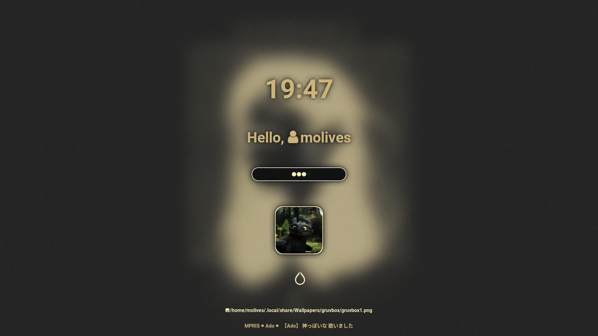

# Dotfiles

This repository contains my Arch Linux dotfiles.





## ⚠️ Disclaimer

This config may or may not work depending on your config, especially since I'm running an AMD+Nvidia Optimus setup. I'm not providing an install script (Working on it!), so I'd recommend to browse through the files and borrow what you want instead.

## Config details

- OS : Arch Linux
- DE/WM : Hyprland
- Qt/GTK theme : Orchis Dark
- Shell : zsh
- Terminal emulator : foot / [kitty](https://sw.kovidgoyal.net/kitty/)
- Text editors : Micro, VSCode, VSCodium, Neovim (not really lol)
- File managers : Thunar, yazi
- Color scheme generation utility : [pywal](https://github.com/dylanaraps/pywal)
- Audio EQ (and more) : [EasyEffects](https://github.com/wwmm/easyeffects)
- AUR helper/wrapper : [paru](https://github.com/Morganamilo/paru)
- App launcher : rofi
- Top bar : Waybar
- Screen locker : hyprlock
- Wallpaper setter : swww
- Cursors : Bibata-Modern-Classic (both XCursor and Hyprcursor)
- Firefox userChrome : [Onebar](https://codeberg.org/Freeplay/Firefox-Onebar)
- Terminal image display utility: chafa
- `ls` replacement : eza
- `cat` replacement : bat
- Audio visualizer : cava

## Details

### Wallpapers

I included some wallpapers in this repo. However, it's just for examples of my favorite wallpapers, my actual collection is in another repo.

### cava

The cava configuration must be a symlink to `~/.cache/wal/colors-cava` to work with pywal.

Update pywal and type

```shell
ln -sf ~/.cache/wal/colors-cava ~/.config/cava/config
```

in a shell to set the config.

## Packages

### Native

```shell
paru -S hyprland xorg-xwayland waybar python-pywal polkit-kde-agent \
xdg-desktop-portal xdg-desktop-portal-hyprland eza bat 
```

### AUR

```shell
paru -S swaync swww rofi-lbonn-wayland-git rofi-power-menu python-pywalfox hyprlock
```

## Scripts found in my dotfiles

### rofi related scripts

#### rofi-paper

Change your wallpaper with `SUPER+W`. It uses [hywal](#hywal) as a backend.

#### rofi-music

Play your music and playlists with `SUPER+shift+M`. Your music must be in `~/Music`.

#### rofi-movie

Does the same but with videos, with `SUPER+shift+V`. Your videos must be in `~/Videos`.

### hywal

Hywal is a shell script that will set the wallpaper passed in argument. It also executes `wal -i <wallpaper path>`, and refreshes the pywal utilities that do not have an autorefresh option.

It also writes the wallpaper file path to `~/.config/hypr/scripts/current_wal`, for swaylock to use the wallpaper and for it to
be kept when restarting Hyprland (last part irrelevant with swww). As such, the wallpaper path must be absolute, which hywal manages by using `realpath`.

As mentioned previously, you can use the [rofi-paper](#rofi-paper) script to set a wallpaper.

The script also kills swaync and waybar, as they can't dynamically fetch the new color cache.

It's compatible with swww, but you must uncomment the lines related to it.

### toothfetch

This script is a neofetch/fastfetch wrapper that uses the config file in `~/.config/neofetch/config.tooth.conf` or `~/.config/fastfetch/toothfetch.jsonc`, and displays an image of Toothless the dragon, contained in `~/.local/share/fetch_logos/toothfetch`.

Other than that and displaying "Toothless λ Krokmou" in elder futhark runes, it's literally a copy of my default neofetch/fastfetch configs.

#### Disclaimer

If you choose fastfetch as a backend, your terminal emulator image protocol might not be used by chafa, hence why I set the logo type
to ~~`kitty`~~ `sixel`. Feel free to change it to whatever protocol your emulator may use.

### tsotd

Displays a shot of Toothless the dragon in the terminal. The images are located in `$XDG_DATA_HOME/tsotd`. It uses chafa for maximum compatibility across terminal emulators.

Run

```shell
tsotd -h
```

to list commands.

For upload size reasons, no images have been commited to this repo, so just see this script as a random image fetch utility. If somehow you're looking for the source, it's [right from this Google Drive folder](https://drive.google.com/drive/folders/1FMATT17oeXwDBpUHnAlCwjaO8A1zrstO).
